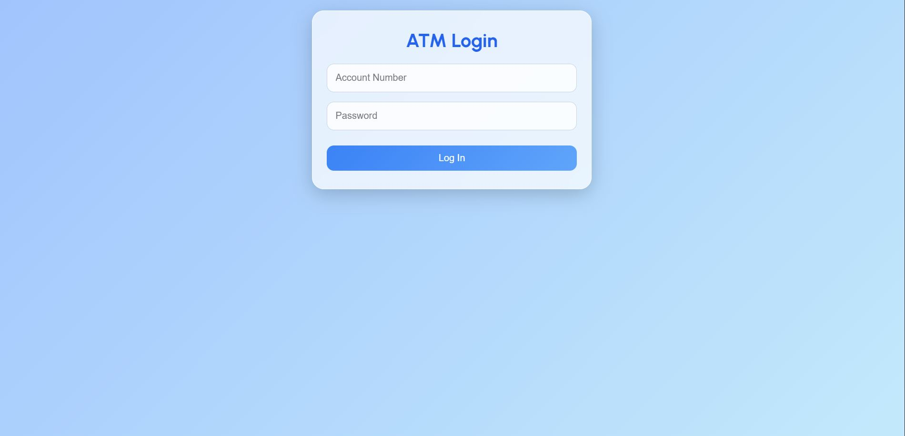
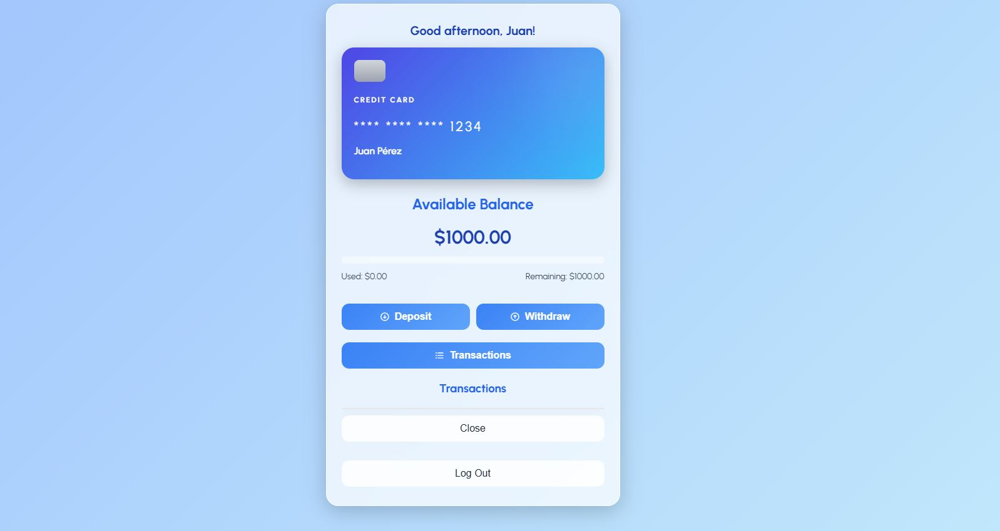

# 💳 **ATM Prototype** 💰

Welcome to the prototype of an **ATM** developed with **HTML**, **CSS** and **JavaScript**! This project simulates the experience of a real ATM, allowing users to:

- Log in with your account
- Check your **available balance**.
- Make **deposits** and **withdrawals** of money
- View your **transaction history**.
- All this, with an **interactive interface** and **responsive design**.

### 🖼️ Preview





### ✨ Watch how it works


---
## 🗂️ File Structure
```
ATM/
├── index.html       # Cashier main interface: login, profile and actions
├── style.css        # ATM visual styles
├── script.js        # ATM operating logic (login and transactions)
└── README.md        # Project documentation 

```
---
## 📚 Recursos utilizados

- [MDN Web Docs - HTML](https://developer.mozilla.org/es/docs/Web/HTML)  
- [MDN Web Docs - CSS](https://developer.mozilla.org/es/docs/Web/CSS)  
- [MDN Web Docs - JavaScript](https://developer.mozilla.org/es/docs/Web/JavaScript)  
- [JavaScript.info](https://javascript.info/)  
- [W3Schools - HTML Forms](https://www.w3schools.com/html/html_forms.asp)  
- [W3Schools - JavaScript Events](https://www.w3schools.com/js/js_events.asp)  
- [CSS Tricks - Centering in CSS](https://css-tricks.com/centering-css-complete-guide/)  
